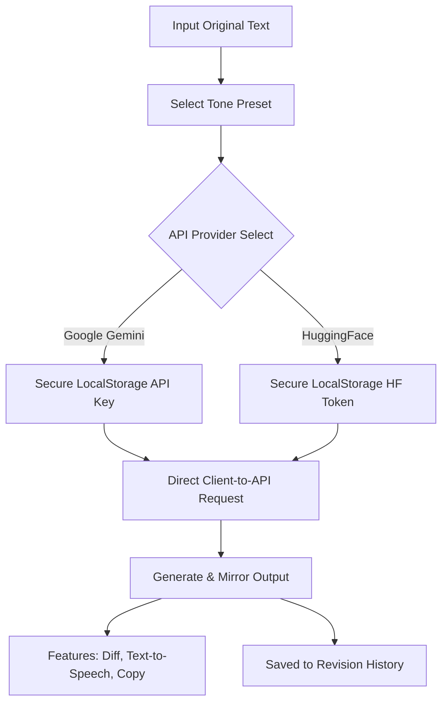

  
  
  # Verbatim Studio
  
  ### *The Premium AI-Powered Text Transformation Suite*

  
  
  

  

    <strong>Verbatim Studio</strong> is a state-of-the-art, client-side web editor engineered for lightning-fast text revisions, tone adjustments, grammar optimization, and AI prompting. Designed with mobile-first responsiveness, it serves as a robust writing assistant that runs completely in your browser.
  

---

## 🚀 Live Access & Repository

* 🌐 **Live Studio:** [mahdialaaaldin.github.io/verbatim](https://mahdialaaaldin.github.io/verbatim/)
* 📦 **GitHub Repository:** [github.com/mahdialaaaldin/verbatim](https://github.com/mahdialaaaldin/verbatim)

---

## ✨ Features at a Glance

### 🧠 Dual-Engine AI Support
Choose your preferred AI powerhouse:
* **Google Gemini AI** (via Gemini API) for advanced logic and premium content generation.
* **Hugging Face Serverless** (using Llama 3.1) for high-performance serverless text completions.

### 🎭 Tone Presets
Instant transformations with tailor-made system prompt structures:
* ✨ **Correct & Polish (`improve`)**: Fix grammar, flow, and phrasing.
* 💼 **Professional (`professional`)**: Formalize text for corporate, research, or email correspondence.
* 💬 **Conversational (`casual`)**: Turn dry drafts into friendly, approachable messages.
* 🗜️ **Summarize (`summarize`)**: Compress long paragraphs into core takeaways.
* 📊 **Bullet Points (`bullet`)**: Convert blocks of text into structured, readable lists.
* 📐 **Expand (`expand`)**: Elaborate on brief points to write complete ideas.
* 🎭 **Sarcastic (`sarcastic`)**: Rewrite text with dry humor and wit.
* 🤖 **Prompt Architect (`prompt`)**: Turn basic ideas into optimized LLM system prompts.

### 🎨 Visual & UI Excellence
* 🌓 **Adaptive Dark Mode**: Switch between a clean slate interface and a dark space aura.
* 🔍 **Real-Time Diff Viewer**: Interactively compare original and AI-modified texts with clear word-level insertions and deletions.
* 🎙️ **Text-to-Speech Output**: Read back rewritten text using native browser-based speech synthesis audio controls.
* 📜 **Revision History Ledger**: Automatically save previous transformations. Restore, copy, or delete drafts in one click.
* 📱 **PWA & Mobile Optimization**: Configured as an iOS Web App with custom apple-touch icons and status-bar colors for a native app feel when added to the home screen.

---

## ⚙️ How It Works

---

## 🔐 API Key Setup & Security

Verbatim Studio works entirely on the client side. **Your API keys are never sent to external third-party servers**—they are saved directly inside your browser's secure `LocalStorage` and sent only to the official AI providers (Google/HuggingFace).

### Setup Instructions:
1. **Google Gemini:**
   - Obtain a key from the [Google AI Studio API Key Portal](https://aistudio.google.com/app/apikey).
   - Click the gear icon (**API Settings**) in Verbatim Studio.
   - Set the Provider to **Google Gemini AI**, paste your key, and save.
2. **HuggingFace:**
   - Obtain a token from your [HuggingFace Access Tokens Settings](https://huggingface.co/settings/tokens).
   - Choose **HuggingFace Serverless** in API Settings, enter the token, and save.

---

## 🛠️ Tech Stack

* **Structure & UI**: HTML5 & [Tailwind CSS](https://tailwindcss.com) (via CDN config)
* **Fonts & Icons**: Outfit & Inter (Google Fonts), Font Awesome 6
* **AI Connection**: Native Fetch API (Google Gemini API & HuggingFace Hub API)
* **Diff Engine**: Text comparison diff highlights (`<ins>` / `<del>`)

---

## 📲 Installing as a Mobile App (PWA)

Verbatim Studio is fully optimized to run standalone on your smartphone:

### iOS (Safari)
1. Open the [Live Demo](https://mahdialaaaldin.github.io/verbatim/) in Safari.
2. Tap the **Share** button in the navigation bar.
3. Scroll down and select **Add to Home Screen**.
4. Launch the app directly from your home screen for a borderless, full-screen native experience.

### Android (Chrome)
1. Open the [Live Demo](https://mahdialaaaldin.github.io/verbatim/) in Chrome.
2. Tap the **three-dot menu** in the top right.
3. Select **Install app** or **Add to Home screen**.

---

## 📌 Related Projects

* **[CodeSavvy (Browser Extension)](https://chromewebstore.google.com/detail/codesavvy/jenendhnlcnokliclhccikgeohdgfhml)** – The original AI-powered writing assistant extension for your web browser.

---

## 📄 License

This project is licensed under the MIT License - see the [LICENSE](LICENSE) file for details.
